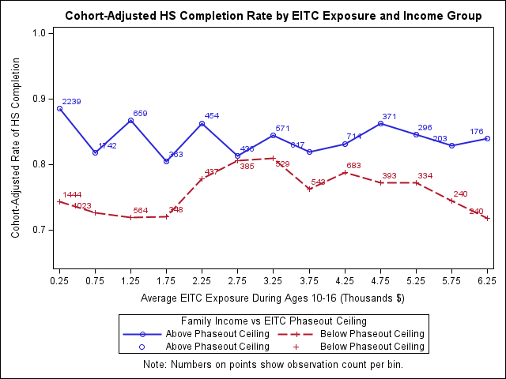
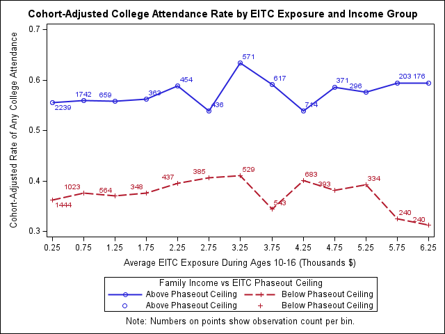
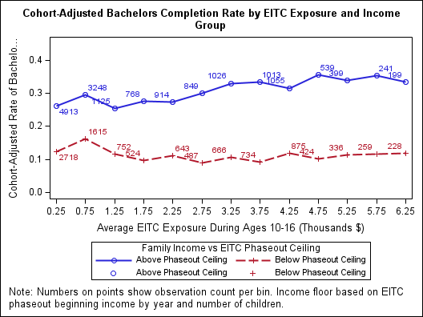

# Earned Income Tax Credit's Effect on Education Outcomes 

This project was created for my capstone class senior year in Economics

## Author
 Saif Elsisy

 ## Introduction
 The Earned Income Tax Credit (EITC) was created in 1975 and was a federal tax credit created to provide financial help to low income families and encourage work due to the inclusion of a wage floor to qualify. Beginning in 1984 with Wisconsin some states also created state level EITC provisions which were primarily a percentage of the federal EITC. Over time both the federal and state EITC increased providing us a natural experiment to examine how an increase in tax credits such as the EITC impact education rates of recipients. 

 I chose to use a measure of EITC called EITC exposure which I saw in an academic paper by Jacob Bastian and Katherine Michelmore titled [*"The Long-Term Impact of the Earned Income Tax Credit on Children's Education and Employment Outcomes*](https://papers.ssrn.com/sol3/papers.cfm?abstract_id=2674603). EITC exposure is just the amount of tax credit a family could qualify for given their state and the number of children in the household independent of income. This means that two families living in Idaho with 3 children where one family makes $15,000 a year and the other makes $120,000 a year both have the same EITC exposure. This allows us to easily run regressions while still being able to separate the impact on recipients by isolating the sample of individuals below the cutoff and those above like done in the plots below. 

<!-- 
## Plans for Development:

## PowerPoint Presentation
-->

## Visuals

 

These plots all display the change in education success by EITC exposure. The group that is below the phaseout ceiling (in red) is qualified to recieve the tax credit since their income is sufficiently low while the group in blue are unqualified since their income is too high. If the tax credit has a positive impact on education success, as we would expect based on economic theory, the red line should have an upward trend while the blue line should have a relatively flatter slope. None of these plots, nor the regression results within the "Regressions" folder tells this story though. This is easily explained by the low R squared values within the models (around 0.1) which just means that the models only explain around 10% of the variability in education outcomes. This means that there could be some variable unaccounted for which negatively affects education but is correlated with the tax credit which is skewing the results.